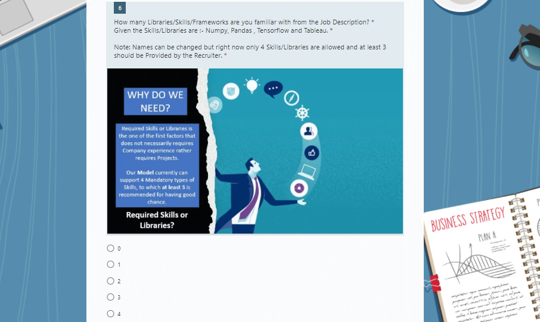

# PyRecruiter


## What is PyRecruiter?

This is a Light weight **Open source Python Package** made specially for **Job Seekers** and **Recruiters** in the field of **Data science and Machine Learning (Currently)**, In order to use the **Power of Machine Learning** to help Shortlist the Right Candidates for a specific Job.

It works according to the right Hiring standards and helps Recruiters to automate the task of going through Hundreds of application and in addition it has it's **own Algorithm** which focuses on **Parameters like:**

* **Required Skills/Libraries/Frameworks**
* **Application based projects on the Required Skills/Libraries/Frameworks**
* **Domain Centric Projects**
* **Story-telling Projects**
* **Good Certifications(Less Weightage)** 
* **Candidates Looking for Domain change towards ML/AI**

These parameters play an important role in searching for the right **Data Scientist or a Machine learning Engineer** and also very **less Weightage** is given to Factors like **Education Qualification** and **Work Experience** *(If they chose to go with the Orginal Data)*. It is like a goto Tool specially meant for Recruiters and Talent Acquitions so that they can handle Large number of Applicants in an organised way. 


## How much Coding do you require in order to run PyRecruiter?

This Package specially focuses on **Recruiter's ease** that is why it has very **few lines of code** in order to run our default model **(Actually around 3-4 lines to be honest)**. If you are familiar with Python and it's Libraries, you can definitely use it to make more accurate or add your own optimised models but the **Default model has been well optimized** and is more than enough for people with **no background knowledge in Machine learning or Data science**. 

## How it Works?

It is a Two Step Process where the Recruiter can take Candidate Information through Microsoft Forms Template for which the link would be given in below in the Readme File. 
Candidates would fill the form and the response would be directed to the Recruiter's response excel sheet.

## Let's Understand how Recruiters can Play around with the Microsoft Template and what are the Guidelines?

#### Link to the Shareable Template : [Microsoft Forms Template](https://forms.office.com/Pages/ShareFormPage.aspx?id=DQSIkWdsW0yxEjajBLZtrQAAAAAAAAAAAAMAAP0NdvxUODk5SzIzUDNCWEJKMUlEVU5QVlcxR1g3SS4u&sharetoken=w2KLYBfeSbYsfPMujHCd)

Recruiters are requested to Understand what how would this Form do and upto what limit they can change the Form according to the Job Description.**Note: Recruiters are requested to Duplicate the Same Template and Recruiters can change the Question content based on the JD but the whole Meaning and the Options should not Change**


<br />


### Let's Take an Example and compare a Random Job Description and see how a Recruiter can use the Information from JD to the Form
<br />

<br />

<br />This Package also gives Recruiters an additional option to know if the Candidate is looking for a **Domain change towards ML/AI.** 

<br />

<br />Here Experience part here is given as 5-7 years in the JD but PyRecruiter gives Recruiters to set Experience info from Candidate as category of **3 Types which can be Low , Medium and High.** Recruiters can Change the Experience Distribution in the Question but the important thing is to **keep the importance from Low to High form.**<br />


<br />This Package gives Recruiters **3 Options for adding Programming Languages**. For this example it can be Python, R and SLQ. This information can be changed but the Options should not be changed<br />


<br />It also have options for adding **4 Required Skills/Libraries/Frameworks** from the JD. In this example it can be Redshift , Digital Ocean , S3 and Spark.



<br />If there are **Required Skills** then Candidates should have **Applied Projects with regards to the same skills**. This Package accepts 4 types which should be the **Number of Projects the Candidates has with respect to the Number of Skills.**

<br />

<br />This Package also gives an important additional skill which is the Number of **Story-Telling Projects a Candidate has, which are 3 at Max (Currenty).** In this example it can be Experience with **Tableau or visualization libraries.**

<br />

<br />This Package also gives another important additional skill which is the Number of **Domain Centric Projects a Candidate has, which are 3 at Max (Currenty).** In this example it can be Experience with **Banking sector**.

<br />

<br />This Package also gives asks for the **Candidate's Education Qualification** which are **Bachelors , Masters and PHD.** **NOTE:** This info can be changed but the **Order of Importance and the Options should be Same** like 3 would be the Highest one and followed by 2 and 1.

<br />

<br />This Package gives **slight Weightage to Good Certifications** like the **Test Based Certificates and Less Importance to Course Based and No Certificates.**

<br />

## How can a Recruiter use PyRecruiter?


### Codes

#### Recruiters can take that Response excel sheet and go to their Command line and do following Codes:-

```python

pip install pyrecruiter as pr

```

<br />Here the Recruiter can **Install the PyRecruiter package from PyPi**

```python


model = pr.Model()

```

<br />This command would **initiate the Model class** that is in the .py file.

```python

model.train_model()

```

<br />Here the user gets an option by including **dataset parameter** which gives Recruiters an option to include either the `dataset = 'orig_data` **(Default)** or `dataset = experience Data` which is biased towards high **Experience**.


```python

model.load_test_data(data_path='New Microsoft Excel Worksheet.xlsx')

```

<br />Here Recruiters can provide the path to the Response excel sheet which they get through Microsoft forms 

```python

model.evaluate()

```
<br />Now they can see the **Results** in the command line as well as they get an **Excel Sheet containing the Names and Email IDs of all Candidates with their Probability of Getting shortlisted as well as the Predicted Result.**

## How can a Job Seeker or a Contributer who is familiar with Python can use PyRecruiter?

<br />

```python

pip install pyrecruiter as pr

```

Here the User can **Install the PyRecruiter package from PyPi**


```python


Model_data = pr.Model()

```

This command would **initiate the Model class** that is in the .py file.


```python


Model_data = pr.Model(dataset='experience_data')

```


Here the Users gets an option by including **dataset parameter** which gives Recruiters an option to include either the `dataset = 'orig_data` **(Default)** or `dataset = experience Data` which is biased towards high **Experience**.

Now the Contributers can **create their own model** with the data they want to train on and can **imporove the Accuracy or include new features through Feature Engineering.**


```python

model.load_test_data(data_path='New Microsoft Excel Worksheet.xlsx')

```

Here Users can provide the path to the Response excel sheet which they get through Microsoft forms 


```python

model.evaluate()

```

Now they can see the **Results** in the command line as well as they get an **Excel Sheet containing the Names and Email IDs of all Candidates with their Probability of Getting shortlisted as well as the Predicted Result.**


### Results


<br />


> This Package focuses on **Minimum code** and the **Right Parameters** for Shortlisting Candidates apart from the Traditional Parameters like __Education Qualification__ and **Work Experience**. 

